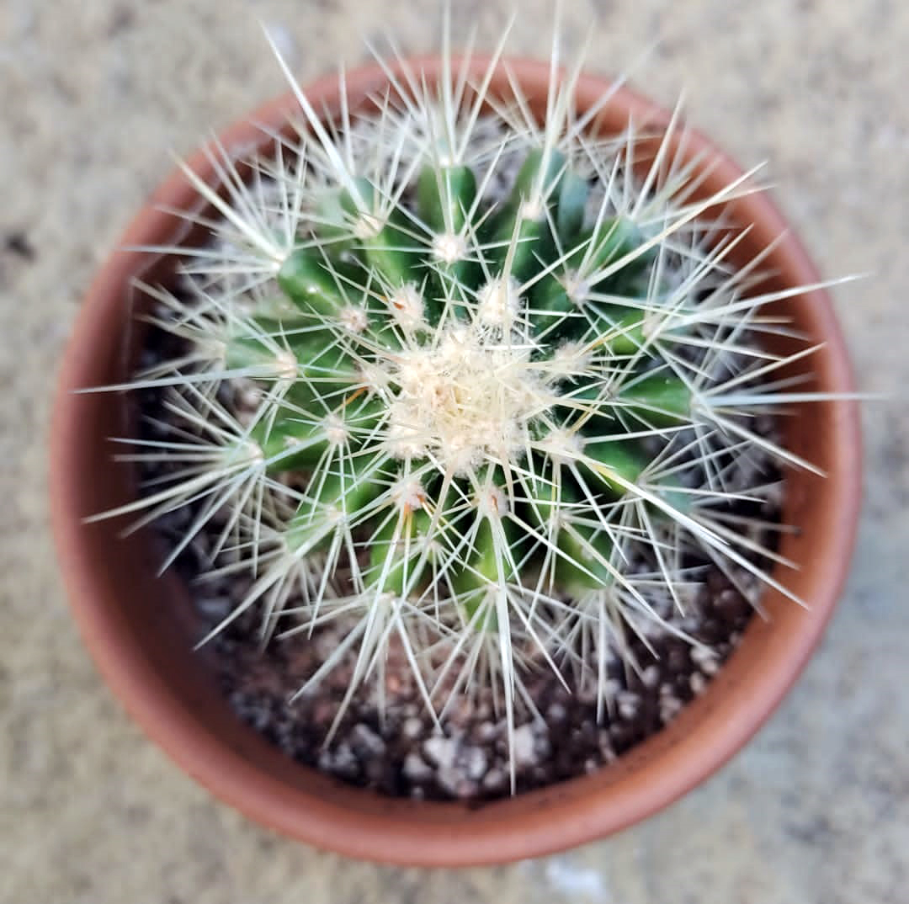
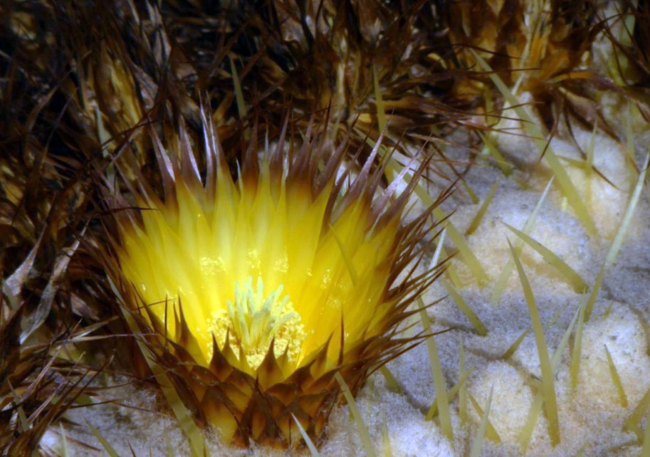

    

        <!-- content page -->
        <section class="section_about clearfix">
            

                

                    

                        

                        
                            Echinocactus Grusonii in Kevin Begley's collection grows outside all year round
                        
                        <h4>
                            Echinocereus grusonii - cactus of commercial success
                        </h4>
                        

                            
                                by Jurate Šimkutė
                                |
                            
                            
                                cactus
                            
                        

                        

                            It does not matter if ones interaction with cacti is just recognising them as spiky plants that more than likely will hurt you with the slightest touch or one is seasoned cacti collector, you've definitely seen Echinocactus Grusonii at some point. 
                            It is not a surprise – this cactus has been known to us for over 130 years. This massive specimen was an instant attraction in cactus world. Big, spiny and not that hard to look after, it grows from 20cm to 130cm in diameter and can reach up to 1m in height. <a onclick="expand()">Learn more >></a>
                        

                        

                        

                            In more southern countries, this cactus makes a perfect landscaping plant. In countries like Spain, Greece, Portugal these cacti can be seen as a beautiful garden piece. 
                            Surprisingly enough even in our climate we do have growers who are growing them outside all year round. Kevin Begley got his
                            E. Grusonii few years back in Cornwall and is now growing it in xeric bed with a top covering. 
                            His grusonii seems to be doing great, given how unforgiving Irish climate can get.
                        

                        
 
                            But how about its natural habitat? Well, the situation is not all that good. The primary habitat for E. Grusonii is being slowly destroyed.
                            Even though there are millions and millions of this plant produced and sold all around the world, natural habitat plants are dwindling away. Due to dam construction in Hidalgo, Mexico it is now estimated that there is as little as 50 plants left in the wild and the plant is now critically endangered.  
                        

                        
                        
                        

                            The so lovingly called Mother-in-Law's Cushion is extremely easy to grow. So if you got a small plant in your local shop, all you need is a little time. Well maybe 20 years or so...
                            All cacti do well in permeable soil. 
                            Some of them need more organic soil and some of them do not need it at all. E. Grusonii will do well in a basic cactus soil mix (1:1:1 soil, sand, grit). 
                            It needs sunny exposure for good spinal growth and good health. It flowers only when mature (30-40cm in diameter) bright yellow flowers can be missed if plant is particulary big. 
                            They need a lot of sun exposure to open up and any shade would inhibit flower from opening. Depending on how many flowers did E. Grusonii set, you  may get a lot of seed pods which takes couple of months to ripen and provide seed. Rest period for this specimen starts mid September and finished mid March to April. During this time plants should not be watered and kept dry. Mature plants can survive at sub-zero temperatures while younger plants should be overwintered at 4-7 degrees celsius.
                        

                        
                        

                            So if you got yourself E. Grusonii, enjoy growing it! With correct care this plant will last you a life time and will deifnitely be interesting piece for conversation with your neighbours or friends.
                        

                    

                    

                

            

        </section>
    

